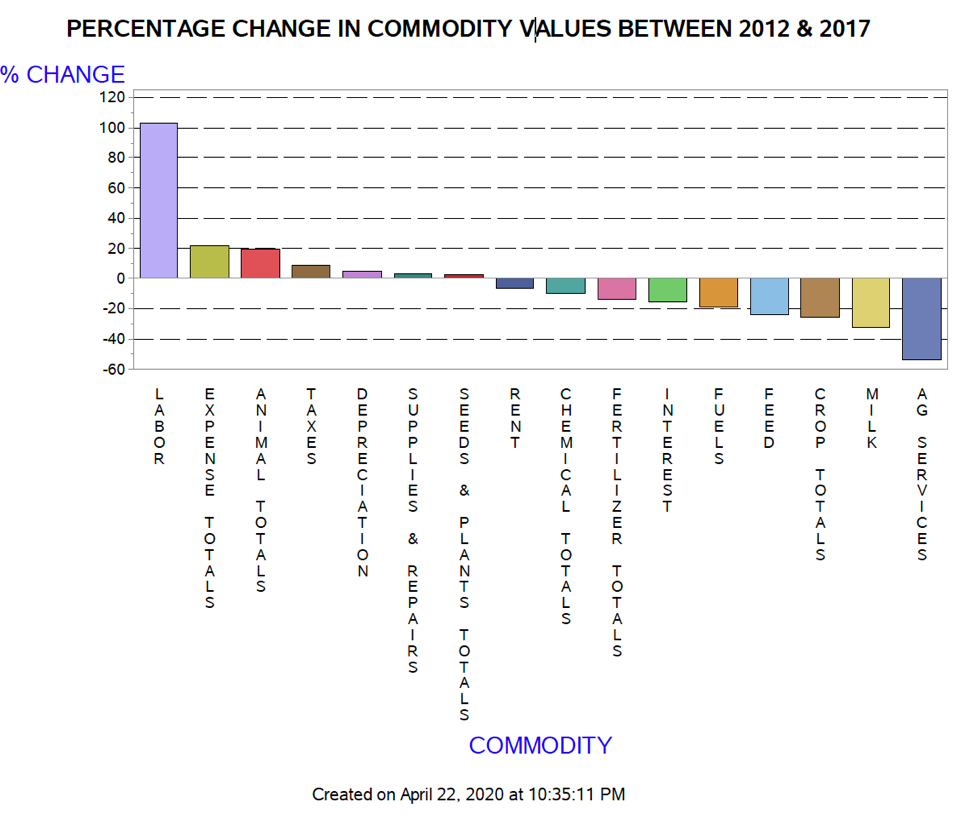

# NORTH-CAROLINA-USDA-COMMODITY-DATA-ANALYSIS
- - -
Analyzed United States Department of Agriculture Census data using SAS and Python to explore how agricultural commodities in North Carolina have changed from 2012 to 2017. The url to view the result is attached in the description above and a pdf copy of the report is present in the repository.
- - -
## DATASET SOURCES

1. [USDA NASS Database] (https://quickstats.nass.usda.gov/)

2. [NOAA National Climatic Data Center] (https://www.ncdc.noaa.gov/data-access/quick-links#gsod)

3. [Bureau of Transportation Statistics: geospatial data] (https://data-usdot.opendata.arcgis.com/)

4. [NC Budget and  Management  Dataset] (https://www.osbm.nc.gov/demog/county-estimates)
- - -
# SOME OF THE INFOGRAPHICS INCLUDES:

- - -

- - -

- - -

